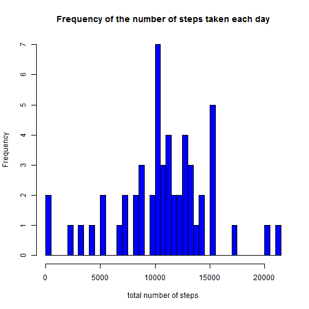
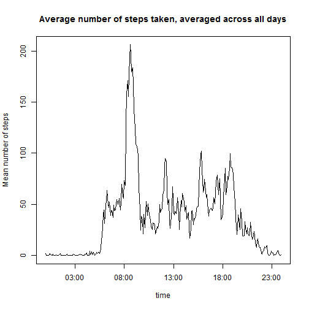
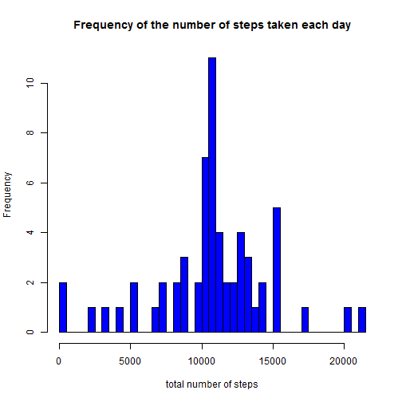
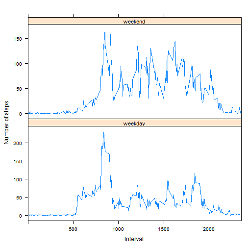

# Reproducible Research: Peer Assessment 1


```r
opts_chunk$set(echo=TRUE)
```

## A. Loading and preprocessing the data
##### note: it is assumed that the file has been extracted from the zip archive and is available in the local directory.


```r
activity_data<-read.csv("activity.csv")
```

## B. What is the mean total number of steps taken per day?
##### note: missing (i.e., 'NA') values are left in the data file until later.

### Histogram of the total number of steps taken each day:


```r
## regroup the data by date and sum steps
hist1<-aggregate(steps ~ date, activity_data, sum)

hist(hist1$steps,breaks=50,col="blue",main="Frequency of the number of steps taken each day",xlab="total number of steps")
```

 

### Mean and median total number of steps taken per day:


```r
mean(hist1$steps)
```

```
## [1] 10766
```

```r
median(hist1$steps)
```

```
## [1] 10765
```

## C. What is the average daily activity pattern?

### Time series plot of average number of steps taken, averaged across all days:


```r
## regroup data by interval and calculate the mean
series1<-aggregate(steps ~ interval, activity_data, mean)

## change the reporting interval to hours for x-axis label
timeofday <- strptime(sprintf("%04d", series1$interval), "%H%M")

plot(timeofday,series1$steps, type="l", ylab="Mean number of steps", xlab="time",main="Average number of steps taken, averaged across all days")
```

 

### 5-minute interval row that contains the maximum number of steps:


```r
maxindex<-which.max(series1$steps)
series1[maxindex,]
```

```
##     interval steps
## 104      835 206.2
```

## D. Imputing missing values

### Total number of missing values in the dataset:


```r
sum(is.na(activity_data$steps))     #counting NA's
```

```
## [1] 2304
```

### Filling in the missing values by replacing them with the mean of the 5-minute interval as evaluated in part C above:


```r
## copy data set for modification
ad2<-activity_data

## loop through rows and make substitutions where a NA is encountered
for (i in 1:17568) {
    if (is.na(ad2$steps[i])==TRUE) {
        for (j in 1:288) {
            if (ad2$interval[i]==series1$interval[j]) {
                ad2$steps[i]<-series1$steps[j]
            }
        }
    }
}
```

### Histogram of total number of steps taken each day:


```r
## regroup the data by date and sum steps
hist2<-aggregate(steps ~ date, ad2, sum)

hist(hist2$steps,breaks=50,col="blue",main="Frequency of the number of steps taken each day",xlab="total number of steps")
```

 

### Mean and median total number of steps taken per day (NAs replaced):


```r
mean(hist2$steps)
```

```
## [1] 10766
```

```r
median(hist2$steps)
```

```
## [1] 10766
```
### Do these values differ from the estimates from part B? Not really as the missing data are replaced by mean values and so do not affect the mean.

### What is the impact of imputing missing data? Increased the total number of steps but barely altered the overall shape of the distribution.


## E. Differences in activity patterns between weekdays and weekends?


```r
## add column for day of the week in numerical form
ad2$day<-setNames(1:7, c("Monday", "Tuesday", "Wednesday", "Thursday", "Friday", "Saturday", "Sunday"))[weekdays(as.Date(ad2$date))]

## regroup data by interval and calculate the mean for each category 
series2week<-aggregate(steps ~ interval, data=subset(ad2,day<=5), mean)
series2weekend<-aggregate(steps ~ interval, data=subset(ad2,day>=6), mean)

## use lattice plotting for panel plot
require(lattice)
```

```
## Loading required package: lattice
```

```r
my.strip <- function(which.given, which.panel, ...) {
    strip.labels <- c("weekday","weekend")
    panel.rect(0, 0, 1, 1, col="#ffe5cc", border=1)
    panel.text(x=0.5, y=0.5, adj=c(0.5, 0.55), cex=0.95,
               lab=strip.labels[which.panel[which.given]])
}
xlim <- range(series2week$interval)   
xyplot(series2week$steps+series2weekend$steps ~ series2week$interval,
       scales=list(y="free", rot=0), xlim=xlim,
       strip=my.strip, outer=TRUE, layout=c(1, 2, 1), ylab="Number of steps", 
       xlab="Interval", panel=function(x, y, ...) 
           {panel.xyplot(x, y, ..., type="l", lwd=0.5)
            }
       )
```

 
### PA1 completed
